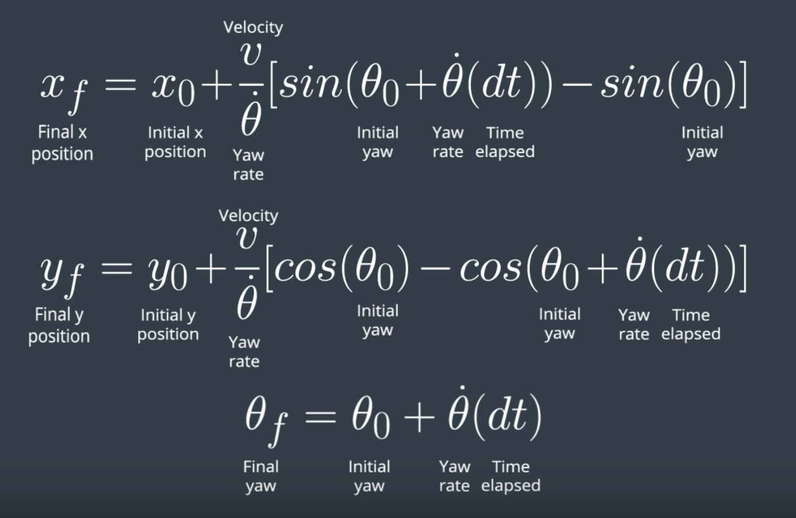
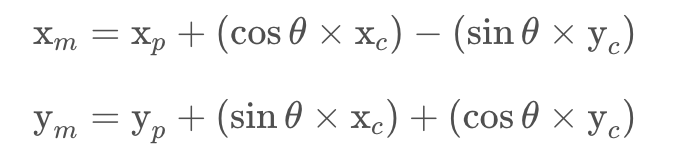

## "Kidnapped" Vehicle Project


The goal of this project is the implementation, in C++, of a 2D Particle Filter capable of localizing a vehicle using as input noisy sensor measurements and a feature map of the environment, with no "a priori" information (hence the "Kidnapped" situation). The state of the vehicle will be expressed by the x, y coordinates and the yaw (steering) angle theta.

The source code is contained in the [src](./src) folder in this git repo. It is the evolution of a starter project provided directly by Udacity, where the [particle_filter.cpp](./src/particle_filter.cpp) was modified. The other files have been left fundamentally unchanged.

The following sections of this writeup will provide details on the filter operations and the data flow, and in doing so the fundamental pieces of the code will be explained. A final [Results](Kidnapped_Vehicle_writeup.md#filter-results) section will show the outcomes of the filter running against the reference data set. 

[//]: # (Image References)

[image1]: (./pictures/BycicleModel.png =100x200) "Bycicle Model Equations"
[image2]: ./pictures/FinalScreenshot.png "Filter Final Screenshot"

---
## Data Input

The data source for this Filter will be the Udacity [simulator](https://github.com/udacity/self-driving-car-sim/releases). The compiled code will open a websocke session to the sim and provide localization information that will be shon on the screen.

### _The Map_

The simulator will load a feature map described through the [`map_data.txt`](./data/map_data.txt) file that can be found in the `data` directory. This file includes the position of landmarks (in meters) on an arbitrary Cartesian coordinate system. Each row has three columns, describing x position, y position and landmark id.

the map is read in the [main.cpp](./src/main.cpp) file (lines 40-45):

```sh
  // Read map data
  Map map;
  if (!read_map_data("../data/map_data.txt", map)) {
    std::cout << "Error: Could not open map file" << std::endl;
    return -1;
  }
```

the `read_map_data` function is defined in [helper_functions.h](./src/helper_functions.h) (lines 85-122).

## Initialization

The first thing that happens to the filter is to have its state initialized at the value of the first measurement ([main.cpp](./src/main.cpp), line 66-73).

```sh
  if (!pf.initialized()) {
    // Sense noisy position data from the simulator
    double sense_x = std::stod(j[1]["sense_x"].get<string>());
    double sense_y = std::stod(j[1]["sense_y"].get<string>());
    double sense_theta = std::stod(j[1]["sense_theta"].get<string>());

    pf.init(sense_x, sense_y, sense_theta, sigma_pos);
  }
```

The `pf.init(...)` instruction initializes the filter starting with the (x,y,theta) collected through simulated GPS measurements in the previous three lines. The actual `init(...)` function is coded in [particle_filter.cpp](./src/particle_filter.cpp) (lines 39-72) and in it a vector of particles is created around the measured position, considering the noise of the GPS measurement. All the initial particle weights are set to 1.0.

The definiton of the normal distribution functions can be found in lines (44-51):

```sh
  // Set random engine for generating noise
  std::default_random_engine gen;

  // Creates normal (Gaussian) distributions for x, y, theta, given the noises
  // and positions in input
  normal_distribution<double> dist_x(x, std[0]);
  normal_distribution<double> dist_y(y, std[1]);
  normal_distribution<double> dist_theta(theta, std[2]);
```

where `x, y, theta` are inputs representing the initial measurements, and `std[]` is a vector of size 3 containing the standard deviations for the GPS errors for the three variables.

The actual assignment of values to the particles happens in lines (56-68):

```sh
  // Creating a particle to assign data to
  Particle currentParticle;

  for (int i = 0; i < num_particles; ++i) {

    currentParticle.id = i+1;                 // Assigning an id
    currentParticle.x = dist_x(gen);          // Sampling from x distribution
    currentParticle.y = dist_y(gen);          // Sampling from y distribution
    currentParticle.theta = dist_theta(gen);  // Sampling from theta distribution
    currentParticle.weight = 1.0;             // Assigning a weight = 1

    // Append particle to vector
    particles.push_back (currentParticle);
  };
```

### _Number of Particles_

The number of particles to consider in the filter in also set in the `init(..)` function, at the very beginning (line 42)

```sh
  // Set number of  particles
  num_particles = 1000;
```

In the [Results](Kidnapped_Vehicle_writeup.md#filter-results) section we will spend few words on the effect of this number on the performances of the sistem. 

## Prediction

The Prediction steps emulates the motion of the vehicle starting from each of the particles (that are a collection of possible positions). For this purpose we will use a simple _Bycicle Model_ based on the following assumptions:

1. No vertical dynamics (pure 2D motion);
2. Rigid body;
3. Front wheels acting together --> they can be considered as one. Same applies to the rear wheels;
4. Only controls are the _Yaw (Steering) Rate_ and the _Velocity of the Vehicle_;
5. Control are assumed constant for a sampling interval.

In this case, the kinematics of the vehicle can be expressed by:

<p align="center">
  
</p>

The prediction step is actually called from [main.cpp](./src/main.cpp) (lines 73-80):

```sh
   // Predict the vehicle's next state from previous
   //   (noiseless control) data.
   double previous_velocity = std::stod(j[1]["previous_velocity"].get<string>());
   double previous_yawrate = std::stod(j[1]["previous_yawrate"].get<string>());

   pf.prediction(delta_t, sigma_pos, previous_velocity, previous_yawrate);
```

and the `prediction(...)` function is implemented in [particle_filter.cpp](./src/particle_filter.cpp) (lines 84-144). The implementation of the model is on lines (124-129):

```sh
   // BYCICLE MODEL
   xf = x0 + vOverThetaDot * (sin(theta0 + (yaw_rate * delta_t)) -
             sin(theta0));
   yf = y0 + vOverThetaDot * (cos(theta0) -
             cos(theta0 + (yaw_rate * delta_t)));
   thetaf = theta0 + (yaw_rate * delta_t);
```

On top of the motion propagation we also add process noise charactized as gaussian with 0 mean. The distribution functions are introduced in lines (86-93):

```sh
   // Set random engine for generating noise
   std::default_random_engine gen;

   // Create normal (Gaussians) distribution for x, y, theta given the noises
   // in input and mean = 0.0
   normal_distribution<double> dist_p_x(0.0, std_pos[0]);
   normal_distribution<double> dist_p_y(0.0, std_pos[1]);
   normal_distribution<double> dist_p_theta(0.0, std_pos[2]);
```

And applied in lines (131-134):

```sh
   // Add noise
   xf += dist_p_x(gen);
   yf += dist_p_y(gen);
   thetaf += dist_p_theta(gen);
```

## Update Particle Weights

In the Update step for a particle filter can be decomposed in three steps. For each particle:

* We collect observations of landmarks positions as seen from the car. In order to compare with reference landmarks they need to be transformed in the map reference frame --> _Transformation_
* We identify, from the possible landmarks in range, those that are more likely to be associated with the observations. This selection will be based on the distance from the reference landmark --> _Association_
* We calculate the propability of observing those landmarks from the position defined by the current particle. The probability will be the new weight to associate to the particle --> _Update weights_

The Update function is called in [main.cpp](./src/main.cpp), on line 111:

```sh
    pf.updateWeights(sensor_range, sigma_landmark, noisy_observations, map);
```

And the actual implementation can be found in [particle_filter.cpp](./src/particle_filter.cpp), (lines 205-333). In the following we'll describe the main coding elements for each of the three steps identified above.

### _Transformation_

For each particle, the equations to transform an observation from the car reference frame to the map reference frame are:

<p align="center">
  
</p>
 
 Where
 
 * `x_p, y_p, theta` are the coordinates and the orientation of the current particle;
 * `x_c, y_c` are the coordinates of the observed landmark in the car reference frame;
 * `x_m, y_m` are the coordinates of the landmark in the map reference frame
 
 The implementation of the above equations can be found in [particle_filter.cpp](./particle_filter.cpp) (lines 258, 259):
 
 ```sh
    xm = xp + (xc * cos(thetap)) - (yc * sin(thetap));
    ym = yp + (xc * sin(thetap)) + (yc * cos(thetap));
 ```

### _Association_

### _Update Weights_

## Resampling

```sh
    pf.resample();
```

## Accuracy Evaluation


## Compiling the Code

After having cloned this repo and taken care of the dependencies outlined in the repo [README](./README.md), the main program can be built and ran by doing the following from the project top directory.

```sh
mkdir build
cd build
cmake ..
make
./particle_filter
```

Alternatively some scripts have been included to streamline this process, these can be leveraged by executing the following in the top directory of the project:

```sh
./clean.sh
./build.sh
./run.sh
```

Note that the first script is not strictly necessary for the first build, but is good practice to clean the project before subsequent builds.

Once started, the Filter code will open a WebSocket connection trying to reach to a data source, and that will be the Udacity [simulator](https://github.com/udacity/self-driving-car-sim/releases).

## Filter Results

