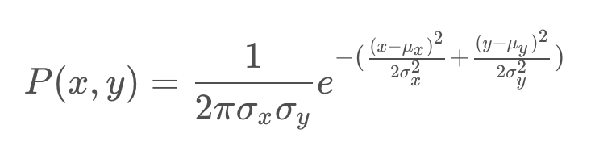
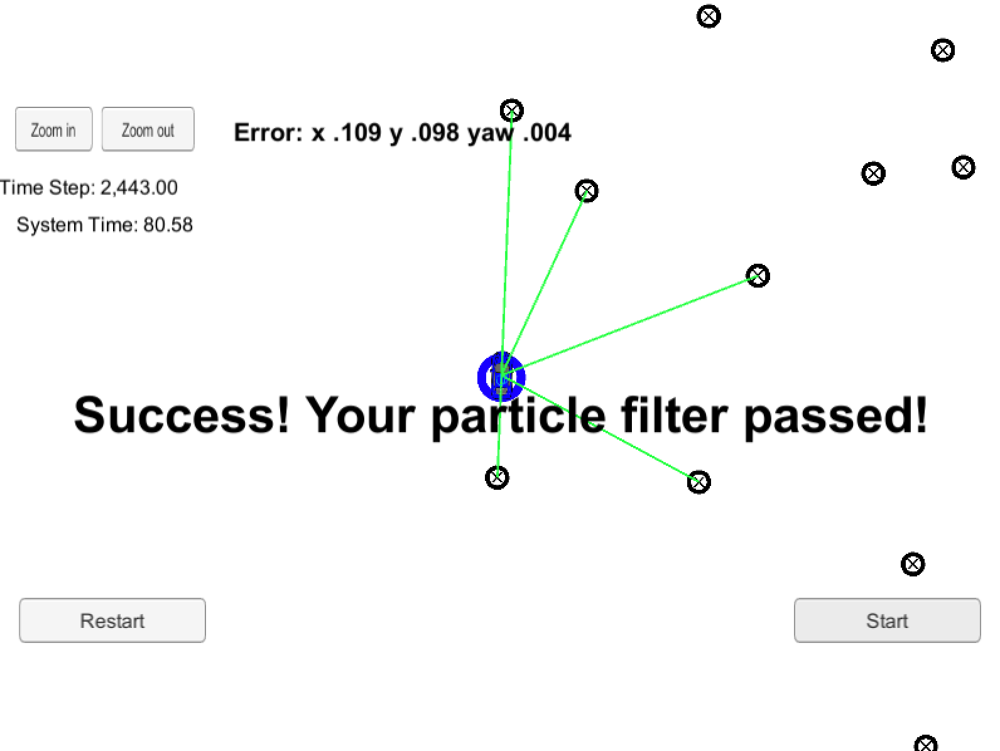
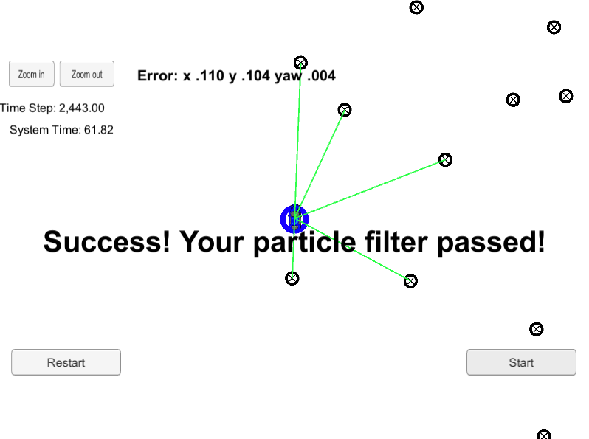
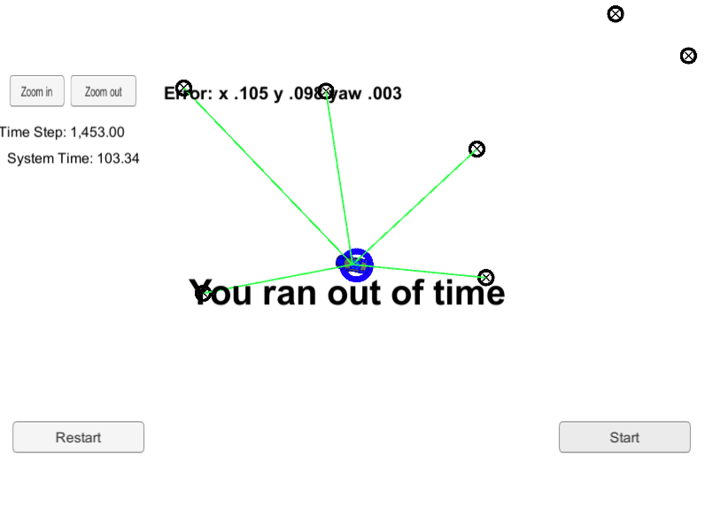

## "Kidnapped" Vehicle Project


The goal of this project is the implementation, in C++, of a 2D Particle Filter capable of localizing a vehicle using as input noisy sensor measurements and a feature map of the environment, with no "a priori" information (hence the "Kidnapped" situation). The state of the vehicle will be expressed by the x, y coordinates and the yaw (steering) angle theta.

The source code is contained in the [src](./src) folder in this git repo. It is the evolution of a starter project provided directly by Udacity, where the [particle_filter.cpp](./src/particle_filter.cpp) and [particle_filter.h](./src/particle_filter.h) were modified. The other files have been left fundamentally unchanged.

The following sections of this writeup will provide details on the filter operations and the data flow, and in doing so the fundamental pieces of the code will be explained. A final [Results](Kidnapped_Vehicle_writeup.md#filter-results) section will show the outcomes of the filter running against the reference data set. 

---
## Data Input

The data source for this Filter will be the Udacity [simulator](https://github.com/udacity/self-driving-car-sim/releases). The compiled code will open a websocke session to the sim and provide localization information that will be shon on the screen.

### _The Map_

The simulator will load a feature map described through the [`map_data.txt`](./data/map_data.txt) file that can be found in the [data](./data) directory. This file includes the position of landmarks (in meters) on a Cartesian coordinate system that will be considered as the Map reference frame. Each row has three columns, describing x position, y position and landmark id.

The map is read in the [main.cpp](./src/main.cpp) file (lines 40-45):

```sh
  // Read map data
  Map map;
  if (!read_map_data("../data/map_data.txt", map)) {
    std::cout << "Error: Could not open map file" << std::endl;
    return -1;
  }
```

the `read_map_data` function is defined in [helper_functions.h](./src/helper_functions.h) (lines 85-122).

## Initialization

The first thing that happens to the filter is to have its state initialized at the value of the first measurement ([main.cpp](./src/main.cpp), line 66-73).

```sh
  if (!pf.initialized()) {
    // Sense noisy position data from the simulator
    double sense_x = std::stod(j[1]["sense_x"].get<string>());
    double sense_y = std::stod(j[1]["sense_y"].get<string>());
    double sense_theta = std::stod(j[1]["sense_theta"].get<string>());

    pf.init(sense_x, sense_y, sense_theta, sigma_pos);
  }
```

The `pf.init(...)` instruction initializes the filter starting with the (x,y,theta) collected through simulated GPS measurements in the previous three lines. The actual `init(...)` function is coded in [particle_filter.cpp](./src/particle_filter.cpp) (lines 39-70) and in it a vector of particles is created around the measured position, considering the noise of the GPS measurement. All the initial particle weights are set to 1.0.

The noise is considered to be Gaussian, and the definiton of the normal distribution functions can be found in lines (44-48):

```sh
  // Creates normal (Gaussian) distributions for x, y, theta, given the noises
  // and positions in input
  normal_distribution<double> dist_x(x, std[0]);
  normal_distribution<double> dist_y(y, std[1]);
  normal_distribution<double> dist_theta(theta, std[2]);
```

where `x, y, theta` are inputs representing the initial measurements, and `std[]` is a vector of size 3 containing the standard deviations for the GPS errors for the three variables (defined in [main.cpp](./src/main.cpp) (lines 35, 36), for this exercise = [0.3, 0.3, 0.01]).

The actual assignment of values to the particles happens in lines (53-66):

```sh
  // Creating a particle to assign data to
  Particle currentParticle;

  // Generate vector
  // NOTE: Random noise generator gen defined in particle_filter.h
  for (int i = 0; i < num_particles; ++i) {

    // Generate particle
    currentParticle.id = i+1;                 // Assigning an id
    currentParticle.x = dist_x(gen);          // Sampling from x distribution
    currentParticle.y = dist_y(gen);          // Sampling from y distribution
    currentParticle.theta = dist_theta(gen);  // Sampling from theta distribution
    currentParticle.weight = 1.0;             // Assigning a weight = 1

    // Append particle to vector
    particles.push_back (currentParticle);
  };
```

Note that in generating the random value from the distributions we make use of a common random generator defined for the whole class in [particle_filter.h](./src/particle_filter.h) (lines 128-129):

```sh
   // Random engine for generating pdf
   std::default_random_engine gen;
```

The same generator will be used through the totality of the code, avoiding repetitions.

### _Number of Particles_

The number of particles to consider in the filter in also set in the `init(..)` function, at the very beginning (line 42)

```sh
  // Set number of  particles
  num_particles = 1000;
```

In the [Results](Kidnapped_Vehicle_writeup.md#filter-results) section we will spend few words on the effect of this number on the performances of the sistem. 

## Prediction

The Prediction steps emulates the motion of the vehicle starting from each of the particles (that are a collection of possible positions). For this purpose we will use a simple _Bycicle Model_ based on the following assumptions:

1. No vertical dynamics (pure 2D motion);
2. Rigid body;
3. Front wheels acting together --> they can be considered as one. Same applies to the rear wheels;
4. Only controls are the _Yaw (Steering) Rate_ and the _Velocity of the Vehicle_;
5. Control are assumed constant for a sampling interval.

In this case, the kinematics of the vehicle can be expressed by:

<p align="center">
  
</p>

The prediction step is actually called from [main.cpp](./src/main.cpp) (lines 73-80):

```sh
   // Predict the vehicle's next state from previous
   //   (noiseless control) data.
   double previous_velocity = std::stod(j[1]["previous_velocity"].get<string>());
   double previous_yawrate = std::stod(j[1]["previous_yawrate"].get<string>());

   pf.prediction(delta_t, sigma_pos, previous_velocity, previous_yawrate);
```

and the `prediction(...)` function is implemented in [particle_filter.cpp](./src/particle_filter.cpp) (lines 82-140). The implementation of the model is on lines (119-124):

```sh
   // BYCICLE MODEL
   xf = x0 + vOverThetaDot * (sin(theta0 + (yaw_rate * delta_t)) -
             sin(theta0));
   yf = y0 + vOverThetaDot * (cos(theta0) -
             cos(theta0 + (yaw_rate * delta_t)));
   thetaf = theta0 + (yaw_rate * delta_t);
```

On top of the motion propagation we also add process noise charactized as gaussian with 0 mean and standard deviation provided as an input through the `std_pos[]` vector (defined in [main.cpp](./src/main.cpp) (lines 35, 36), for this exercise = [0.3, 0.3, 0.01]). The distribution functions are introduced in lines (86-88):

```sh
   // Create normal (Gaussians) distribution for x, y, theta given the noises
   // in input and mean = 0.0
   normal_distribution<double> dist_p_x(0.0, std_pos[0]);
   normal_distribution<double> dist_p_y(0.0, std_pos[1]);
   normal_distribution<double> dist_p_theta(0.0, std_pos[2]);
```

And applied in lines (126-130):

```sh
   // Add noise
   // NOTE: Random noise generator gen defined in particle_filter.h
   xf += dist_p_x(gen);
   yf += dist_p_y(gen);
   thetaf += dist_p_theta(gen);
```

## Update Particle Weights

In the Update step for a particle filter can be decomposed in three steps. For each particle:

* We collect observations of landmarks positions as seen from the car. In order to compare with reference landmarks they need to be transformed in the map reference frame --> _Transformation_;
* We identify, from the possible landmarks in range, those that are more likely to be associated with the observations. This selection will be based on the distance from the reference landmark --> _Association_;
* We calculate the propability of observing those landmarks from the position defined by the current particle. The probability will be the new weight to associate to the particle --> _Update weights_.

The Update function is called in [main.cpp](./src/main.cpp), on line 111:

```sh
    pf.updateWeights(sensor_range, sigma_landmark, noisy_observations, map);
```

And the actual implementation can be found in [particle_filter.cpp](./src/particle_filter.cpp), (lines 205-333). In the following we'll describe the main coding elements for each of the three steps identified above.

### _Transformation_

For each particle, the equations to transform an observation from the car reference frame to the map reference frame are:

<p align="center">
  
</p>
 
 Where
 
 * `x_p, y_p, theta` are the coordinates and the orientation of the current particle;
 * `x_c, y_c` are the coordinates of the observed landmark in the car reference frame;
 * `x_m, y_m` are the coordinates of the landmark in the map reference frame
 
 The implementation of the above equations can be found in [particle_filter.cpp](./src/particle_filter.cpp) (lines 254, 255):
 
 ```sh
    xm = xp + (xc * cos(thetap)) - (yc * sin(thetap));
    ym = yp + (xc * sin(thetap)) + (yc * cos(thetap));
 ```

### _Association_

For the association step, we first select a list of landmarks that are observables from the position of the particle. These will be be the ones in the range of the sensor. This step in implemented in [particle_filter.cpp](./src/particle_filter.cpp), lines (269-283):

```sh
   // First create a vector of landmarks predicted within range from the
   // landmark map.
   // Iterate over landmarks in the map
   for (int k = 0; k < map_landmarks.landmark_list.size(); k++) {

     currentLandmark.x = map_landmarks.landmark_list[k].x_f;
     currentLandmark.y = map_landmarks.landmark_list[k].y_f;
     currentLandmark.id = map_landmarks.landmark_list[k].id_i;

     // check if landmark is in range from the particle, given sensor range
     current_dist = dist(xp, yp, currentLandmark.x, currentLandmark.y);

     if (current_dist <= sensor_range){
       predicted.push_back(currentLandmark);
     }
   }
```

Note that the distance is caluclated through the `dist(..)` function, defined in [helper_functions.h](./src/helper_functions.h) (lines 51-59); the sensor range is provided as an input in the `sensor_range` variable (defined in [main.cpp](./src/main.cpp) (lines 33), for this exercise = 50 m). 

The actual association is done through the `dataAssociation(...)` function, described in [particle_filter.cpp](./src/particle_filter.cpp) (lines 150-190). 
In this function, we iterate through the oberved and predicted landmarks, and we associate those that are the closest according to their euclidean distance. Focusing on the inner loop only we have:

```sh
   // Iterate over predicted Landmarks
   for (int j = 0; j < predicted.size(); ++j) {

     // Extract the prediction
     currentPrediction = predicted[j];

     // Use distance calculator defined in the helper functions
     current_dist = dist(currentPrediction.x, currentPrediction.y,
                         currentObservation.x, currentObservation.y);

     // Check distances and update
     if (current_dist < min_dist ) {
       min_dist = current_dist;
       min_index = j;
     }
```

At the end of the association phase, each observation is updated with the id of the closest predicted landmark ([particle_filter.cpp](./src/particle_filter.cpp), lines 183-188):

```sh
   // Identify closest landmark
   closestPrediction = predicted[min_index];

   // Assign to the observed landmark the id of the closest predicted one
   currentObservation.id = closestPrediction.id;
   observations[i] = currentObservation;
```

### _Update Weights_

The probability of observing the identidied landmark from the current particle position will be expressed as a cumulative multivariate Gaussian distribution.

For each particle, we apply the formula:

<p align="center">
  
</p>

Where:

* `x, y` are the observations in map coordinates; 
* `mu_x, mu_y` are the coordinates of the nearest landmarks;
* `sigma_x, sigma_y` are the std errors in the definition of the landmark position.

Each observation is considered to be independet from the others, and so the cumulative probabilty of all of them will just be the product of the single ones.

The steps described above are implemented in [particle_filter.cpp](./src/particle_filter.cpp) (lines 293-322). The probability computation happens in lines (298-315):

```sh
   // Initialize cumulated probability
   cumulatedProb = 1.0;

   for (int l = 0; l < transformed.size(); l++) {
     // The x and y means are from the nearest landmark, which id is stored
     // in transformed observation
     // NOTE: iterators are 0-based while id start from 1
     mu_x = map_landmarks.landmark_list[transformed[l].id - 1].x_f;
     mu_y = map_landmarks.landmark_list[transformed[l].id - 1].y_f;

     coeff1 = (pow((transformed[l].x - mu_x),2.0) / (2 * pow(sigma_x,2.0)));
     coeff2 = (pow((transformed[l].y - mu_y),2.0) / (2 * pow(sigma_y,2.0)));

     cumulatedProb *= coeffnorm * exp (-(coeff1 + coeff2));
   }

   // Update particle weight and reassign it
   particles[i].weight = cumulatedProb;
```

Where `sigma_x, sigma_x` are defined in [main.cpp](./src/main.cpp) (lines 37, 38) and provided as inputs (for this exercise = [0.3, 0.3]). Note that `coeffnorm` is defined in line 235:

```sh
   double const coeffnorm = 1.0 / (2 * M_PI * sigma_x * sigma_y);
```

In order to be reused in the resampling step the probabilities so calculated will have to be normalized between 0 and 1. To this extent a cumlated weight is calculated while iterating (line 318):

```sh
   // Update cumulated weight
   cumulated_weight += cumulatedProb;
```
and used in a final loop defined in lines (325-328):

```sh
   // After all the previous process, the weights will still have to be normalized
   for (int i = 0; i < num_particles; ++i) {
     particles[i].weight = particles[i].weight / cumulated_weight;
   }
```

## Resampling

After their weights have been updated, the particles get resampled according to them, in order to select thos that have the highest likelihood. The algorith applied for this project is the _Resampling Wheel_ one, and a good description of it can be find in the Udacity video [here](https://www.youtube.com/watch?v=wNQVo6uOgYA).

The resampling is calling from [main.cpp](./src/main.cpp), on line 112:

```sh
    pf.resample();
```

And the `resample()` function is actually implemented in [particle_filer.cpp](./src/particle_filter.cpp) (lines 336-377). Focusing on the implementation of resampling, we first define two uniform distributions, for the `beta` coefficient and for the index parsing the particles' vector (lines 337-347):

```sh
   // Determine maximum weight for current particles
   double highest_weight = -1.0;
   for (int i = 0; i < num_particles; ++i) {
     if (particles[i].weight > highest_weight) {
       highest_weight = particles[i].weight;
     }
   }

   // Uniform distributions for index and beta
   uniform_int_distribution<int> dist_index(1, num_particles);
   uniform_real_distribution<double> dist_beta(0.0, 2.0 * highest_weight)
```

and then we iterate to build a resampled vector (lines 353-372):

```sh
   // Initialize new vector and coefficient beta
   std::vector<Particle> resampledParticles;
   double beta = 0.0;

   // Get starting index randomly
   // NOTE: Random noise generator gen defined in particle_filter.h
   int index = dist_index(gen);

   // Iterate over particles
   for (int j = 0; j < num_particles; ++j) {

     // Increment beta with random generator value
     beta += dist_beta(gen);

     // Check if weight of the particle is greater then beta, and update
     // accordingly
     while (beta > particles[index].weight) {
       beta -= particles[index].weight;
       index = (index + 1) % num_particles;
     }

     // Push sample particle in the new vector
     resampledParticles.push_back(particles[index]);
   }
```

---
## Filter Results

The code in this repo can be complied following the instructions in the main [README](./README.md). The Udacity [simulator](https://github.com/udacity/self-driving-car-sim/releases), that the code will connect to, will show, while running, the accuracy in the tracking and the elapsed time. If the filter succeeds in achieving the required accuracy and completing in less than 100 s (like in this case) the following  message is prompted on the display at the end of the sim:

<p align="center">
  
</p>

The full video of the vehicle executing the track is available in the [video](./video) folder.

One of the interesting to evaluate is the effect of the total number of particles, as mentioned in the [Initialization](./Kidnapped_Vehicle_writeup.md#initialization) section.

The reults above are achieved with a number of particles = 1000, but that can be lowered while still providing satisfactory outcomes. For example, with 100 particles we have:

<p align="center">
  
</p>

From this it can be seen how the error is still comparable but the execution time lowered. Lowering the number of particles, however, affects also the reliability and robustness of the filter, making both the initial sampling and the resampling less effective.

On the other hand, if we increase the number of particles to 10000 we can see that we run out of time:

<p align="center">
  
</p>

Of course the actual performances are depending on the system running the code, but the trend is consistent.
